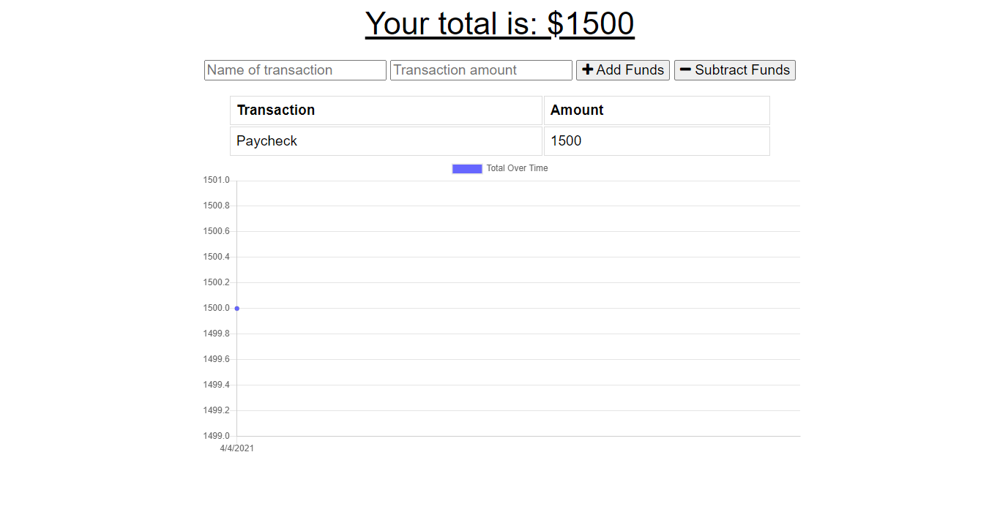

# Offline-Budget-Tracker

## Table of Contents

1. [Description](#Description)
2. [Languages and Technologies Used](#Languages-and-Technologies-Used)
3. [Installation](#Installation)
4. [Usage](#Usage)
5. [Screencaps](#Screencaps)
6. [Deployed App](#Deployed-App)
6. [Questions](#Questions)
<br/>
<br/>

## Description

This application allows a user to track withdrawls and deposits, even when an Internet connection is lost.  It is a full stack application developed in Node.js and deployed on Heroku, making use of IndexedDB and Cache API to store data offline until an Internet connection is restored and the MongoDB Atlas database connection is restored.

Once users post transactions, the transactions are added to the list of transactions, and a representational graph that shows the account balance over time is updated. 

<br/>
<br/>

## Languages and Technologies Used

* HTML
* CSS
* JavaScript
* Node.js
* Express
* MongoDB
* Mongoose
* IndexedDB
* Cache API
* Service Workers
* Heroku

This app is a full-stack solution using HTML, CSS, and Javascript to create the client side.  The server side is built with Node.js, using the Express npm package and also the Mongoose npm package to interact with the MongoDB database.  The app is deployed on Heroku, using a MongoDB Atlas cluster for database storage.  IndexedDB is used to store transactions in a database on the browser until an Internet connection is present.  The Cache API is used to cache static files and api calls to the database to allow the app to continue to work offline through the use of a service worker.
<br/>
<br/>

## Installation

To run the app locally on your PC in development mode, do the following:

1. Install [MongoDB](https://www.mongodb.com/) on your PC.
2. Clone the [repository](https://github.com/BrienBarr/Offline-Budget-Tracker) to your PC.
3. Open the local directory to where you cloned the repository in the command line/terminal.
4. Run the npm i command from the command line/terminal.
```
npm i
```
<br/>
<br/>

## Usage

From the command-line/terminal, run the "mongod" command to start MongoDB.
```
mongod
```

Then, from a different instance of the command-line/terminal run the "npm start" command to start the app.
```
npm start
```

Open up a web browser and go to [http://localhost:3000/](http://localhost:3000/).  This will take you to the client side landing page for the app.

In the command-line/terminal instance running MongoDB, type "Ctrl + C" to exit MongoDB.

In the command-line/terminal instance running the application server, type "Ctrl + C" to stop the server.

Now, you can enjoy an offline experience with the application.

If viewing the deployed application on Heroku, open the deployed link mentioned below and disable your Internet connection temporarily.  Now, you can enjoy an offline experience with the deployed application.

See the deployed app in action on Heroku [here](https://secure-inlet-09030.herokuapp.com/)!

<br/>
<br/>

## Screencaps

<br/>
The landing page of the app<br/><br/>


<br/>
Adding the first transaction<br/><br/>


<br/>
After the first transaction has posted<br/><br/>



<br/>
Adding a second transaction<br/><br/>


<br/>
After the second transaction has posted<br/><br/>


<br/>
The tracking of transactions<br/><br/>


<br/>
<br/>

## Deployed App

See the deployed app in action on Heroku [here](https://secure-inlet-09030.herokuapp.com/)!

<br/>
<br/>

## Questions

[GitHub/BrienBarr](https://github.com/BrienBarr)<br/>
For additional questions, e-mail me at: [brien.barr3320@gmail.com](brien.barr3320@gmail.com)